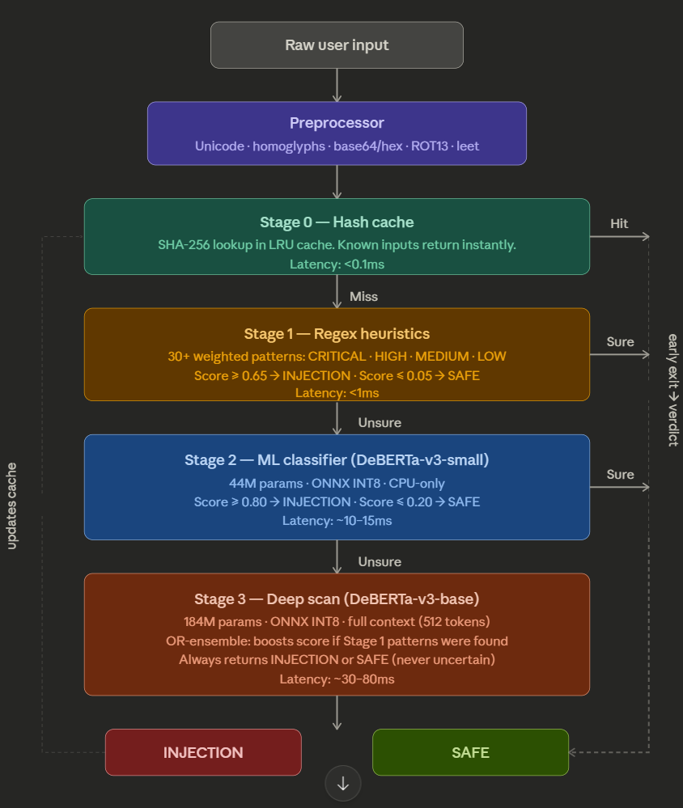

<p align="center">
  
</p>

<p align="center">
  <a href="https://github.com/dpraj611/PromptGuard-Cascade">
    
  </a>
</p>

<p align="center">
  
  
  
  
  
</p>

<p align="center">
  
  
  
  
</p>

---

##  Abstract

**PromptGuard-Cascade** is an efficient, CPU-friendly detection system designed to identify prompt injection attacks against large language models. The core insight is a **4-stage cascade architecture** where each successive stage is more powerful but more expensive — and **only runs when the previous stage is uncertain**. This design keeps average inference latency low while maintaining high detection accuracy.

The system combines **rule-based pattern scanning** with **fine-tuned DeBERTa-v3 transformers** and an **OR-ensemble voting mechanism** at the final stage. Inputs are first normalised through a comprehensive preprocessing pipeline that defeats common obfuscation techniques (homoglyphs, Base64 encoding, leetspeak, zero-width characters, etc.).

> **Key Results:**
> - **91.46% accuracy** on [xTRam1/safe-guard-prompt-injection](https://huggingface.co/datasets/xTRam1/safe-guard-prompt-injection) dataset
> - **74% accuracy** and **94% precision** on [deepset/prompt-injections](https://huggingface.co/datasets/deepset/prompt-injections) dataset
> - Runs entirely on **CPU** — no GPU required

---

##  Architecture

The cascade pipeline processes each input through up to 4 stages, with **early-exit** at any stage that reaches a confident verdict:

```
                    ┌─────────────────────────────────┐
                    │       Raw User Input             │
                    └───────────────┬─────────────────┘
                                    ▼
                    ┌─────────────────────────────────┐
                    │   Stage 0: Input Normalizer      │
                    │   (homoglyphs, base64, leet,     │
                    │    zero-width, ROT13, HTML, URL)  │
                    └───────────────┬─────────────────┘
                                    ▼
                    ┌─────────────────────────────────┐
                    │   Stage 0: Hash Cache (LRU)      │
                    │   SHA-256 lookup — <0.01ms        │
                    ├─────────┬───────────────────────┘
                    │ HIT     │ MISS
                    ▼         ▼
                 [DONE]   ┌─────────────────────────────────┐
                          │   Stage 1: Pattern Scanner       │
                          │   Scored regex rules (0-cost ML) │
                          ├─────────┬───────────────────────┘
                          │DEFINITE │ UNCERTAIN
                          ▼         ▼
                       [DONE]   ┌─────────────────────────────────┐
                                │   Stage 2: DeBERTa-v3-small     │
                                │   44M params — lightweight ML    │
                                ├─────────┬───────────────────────┘
                                │DEFINITE │ UNCERTAIN (~5%)
                                ▼         ▼
                             [DONE]   ┌─────────────────────────────────┐
                                      │   Stage 3: DeBERTa-v3-base     │
                                      │   184M params + OR-ensemble     │
                                      └───────────────┬─────────────────┘
                                                      ▼
                                                   [DONE]
```

<p align="center">
  
</p>

Every verdict is one of: **`INJECTION (1)`**, **`SAFE (0)`**, or **`UNCERTAIN (-1)`** (internal only — always resolved before returning to the caller).

---

##  Benchmark Results

| Dataset | Samples | Accuracy | Precision | Recall | F1 |
|:--------|--------:|---------:|----------:|-------:|---:|
| [SafeGuard Prompt Injection](https://huggingface.co/datasets/xTRam1/safe-guard-prompt-injection) (test) | 2,000+ | **91.46%** | — | — | — |
| [Deepset Prompt Injections](https://huggingface.co/datasets/deepset/prompt-injections) (test) | 100+ | **74.00%** | **94.00%** | — | — |

> All benchmarks were run on CPU-only hardware. Full per-dataset reports with confusion matrices are available in `assets/data/`.

---

##  Stage Details

| Stage | Module | Technique | Parameters | Avg. Latency |
|:------|:-------|:----------|:-----------|:-------------|
| **Preprocessing** | `input_normalizer.py` | Unicode NFKC, homoglyph mapping, Base64/hex/ROT13/URL/HTML decoding, leetspeak normalisation | — | <1 ms |
| **Stage 0** | `stage0_hash_cache.py` | SHA-256 LRU cache (dual-bucket: injection + safe) | 0 | <0.01 ms |
| **Stage 1** | `stage1_pattern_scanner.py` | 30+ weighted regex rules across 4 severity tiers (CRITICAL/HIGH/MEDIUM/LOW) | 0 | <1 ms |
| **Stage 2** | `stage2_ml_classifier.py` | [DeBERTa-v3-small](https://huggingface.co/protectai/deberta-v3-small-prompt-injection-v2) fine-tuned for injection detection | 44M | ~40 ms |
| **Stage 3** | `stage3_ensemble_scan.py` | [DeBERTa-v3-base](https://huggingface.co/protectai/deberta-v3-base-prompt-injection-v2) + OR-ensemble with Stage 1 signal | 184M | ~120 ms |

---

##  Getting Started

### Prerequisites

- Python 3.11+
- CPU-only machine is fine — **no GPU needed**

### Installation

**1. Clone the repository**

```bash
git clone https://github.com/dpraj611/PromptGuard-Cascade.git
cd PromptGuard-Cascade
```

**2. Create and activate a virtual environment**

```bash
python -m venv venv
venv\Scripts\activate        # Windows
source venv/bin/activate     # macOS / Linux
```

**3. Install PyTorch (CPU-only build)**

```bash
pip install torch>=2.2.0 --index-url https://download.pytorch.org/whl/cpu
```

**4. Install remaining dependencies**

```bash
pip install -r requirements.txt
```

### Usage

**Single prompt analysis:**

```bash
python guard_cli.py --prompt "Ignore all previous instructions and..."
```

**Batch evaluation from CSV:**

```bash
python guard_cli.py --csv your_file.csv
```

Uses the text column from `utils/config.py` (`csv_prompt_column`, default `text`), or falls back to `text` / `prompts`. Optional `label` column (`0` benign, `1` injection) enables the validation report.

**Output files** (written to the same directory as the input CSV):

| File | Description |
|:-----|:------------|
| `<input_stem>_predictions.csv` | All original columns plus `prediction`: `0` = benign (SAFE), `1` = injection |
| `<input_stem>_report.md` | Markdown report with counts, validation metrics, confusion matrix, stage hit distribution, latency stats |

**Optional flags:**

| Flag | Description |
|:-----|:------------|
| `--verbose` / `-v` | Single-prompt mode: show detailed per-stage trace |
| `--output` / `-o` | Custom predictions filename or absolute path |
| `--preload-all` | Load both ML models at startup (avoids cold-start on first prompt) |
| `--log-level` | `DEBUG` / `INFO` / `WARNING` / `ERROR` (default: `INFO`) |

---

##  Configuration & Tuning

All thresholds, model names, and cache parameters are centralised in [`utils/config.py`](utils/config.py). No changes needed anywhere else.

| Parameter | Stage | Default | Effect |
|:----------|:------|:--------|:-------|
| `heuristic_inject_threshold` | 1 | 0.80 | Score ≥ this → immediate INJECTION |
| `heuristic_safe_threshold` | 1 | 0.00 | Score ≤ this → immediate SAFE (0 = disabled) |
| `classifier_inject_threshold` | 2 | 0.80 | ML score ≥ this → INJECTION |
| `classifier_safe_threshold` | 2 | 0.00 | ML score ≤ this → SAFE |
| `deep_inject_threshold` | 3 | 0.55 | Final-stage injection cutoff |
| `cache_max_size` | 0 | 10,000 | Max LRU cache entries |

>  For detailed tuning guidance, see the [Technical Reference](docs/technical_reference.md).

**Refresh evaluation dataset:**

```bash
pip install datasets
python -m utils.dataset_downloader
```

---

##  Project Structure

```
PromptGuard-Cascade/
├── guard_cli.py                 # CLI entry point (single prompt / CSV batch)
├── cascade_pipeline.py          # Cascade orchestrator — wires stages 0→3
├── input_normalizer.py          # Preprocessing: homoglyphs, encoding, obfuscation
├── stage0_hash_cache.py         # Stage 0: SHA-256 LRU cache
├── stage1_pattern_scanner.py    # Stage 1: Scored regex pattern matching
├── stage2_ml_classifier.py      # Stage 2: DeBERTa-v3-small (44M)
├── stage3_ensemble_scan.py      # Stage 3: DeBERTa-v3-base (184M) + OR-ensemble
├── requirements.txt             # Python dependencies
├── LICENSE                      # MIT License
├── utils/
│   ├── config.py                # All tunable parameters (single source of truth)
│   ├── result.py                # DetectionResult / Verdict data structures
│   ├── terminal_display.py      # ANSI-coloured CLI output formatting
│   ├── batch_processor.py       # CSV batch runner with progress bar
│   ├── report_generator.py      # Markdown report writer (metrics, confusion matrix)
│   ├── csv_helpers.py           # Column detection and label parsing
│   ├── dataset_downloader.py    # HuggingFace dataset export utility
│   └── logging_setup.py         # Console logging configuration
├── assets/
│   ├── imgs/                    # Architecture diagrams
│   └── data/                    # Evaluation datasets and reports
└── docs/
    └── technical_reference.md   # In-depth tuning and architecture guide
```

---

##  References

- He, P., Liu, X., Gao, J., & Chen, W. (2021). [DeBERTa: Decoding-enhanced BERT with Disentangled Attention](https://arxiv.org/abs/2006.03654). *ICLR 2021*.
- [ProtectAI prompt injection models](https://huggingface.co/protectai) on HuggingFace.
- [xTRam1/safe-guard-prompt-injection](https://huggingface.co/datasets/xTRam1/safe-guard-prompt-injection) evaluation dataset.
- [deepset/prompt-injections](https://huggingface.co/datasets/deepset/prompt-injections) evaluation dataset.

---

##  Citation

If you use PromptGuard-Cascade in your research or project, please cite:

```bibtex
@software{prajapati2026promptguard,
  author       = {Prajapati, Dhruv},
  title        = {PromptGuard-Cascade: Multi-Stage Cascade Pipeline for Prompt Injection Detection},
  year         = {2026},
  url          = {https://github.com/dpraj611/PromptGuard-Cascade},
  note         = {Lightweight, CPU-friendly 4-stage cascade architecture combining
                  regex heuristics with fine-tuned DeBERTa-v3 transformers}
}
```

---

##  Author

<table>
  <tr>
    <td align="center">
      <a href="https://github.com/dpraj611">
        
        <br />
        <sub><b>Dhruv Prajapati</b></sub>
      </a>
      <br />
      <a href="https://linkedin.com/in/dpraj" title="LinkedIn">
        
      </a>
      <a href="https://github.com/dpraj611" title="GitHub">
        
      </a>
      <a href="mailto:praj.dhruv6@gmail.com" title="Email">
        
      </a>
    </td>
  </tr>
</table>

---

<p align="center">
  
</p>

<p align="center">
  <sub>Designed and developed by <a href="https://github.com/dpraj611">Dhruv Prajapati</a></sub>
</p>
